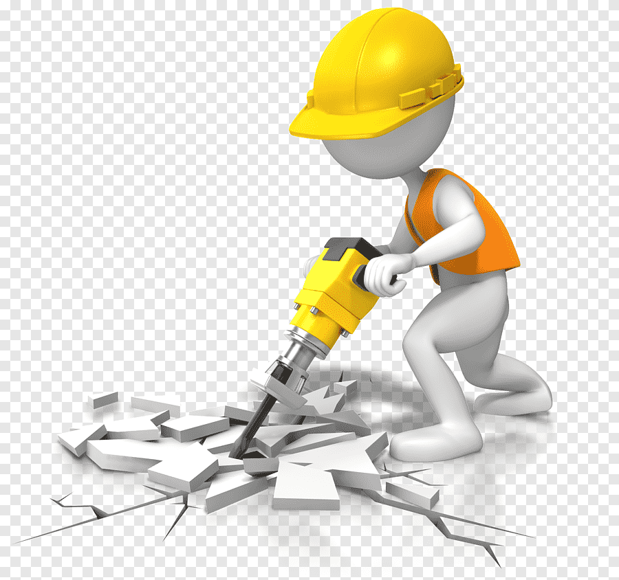

# Library WebRequest

  

## Em Construção :construction:

Esta documentação está atualmenten em desenvolvimento e muitas das funcionalidades estão sendo implementadas para uma melhor passagem de conhecimento de como usar a ferramneta. Mais informações serão adicionadas à medida que o projeto evoluir.

## Descrição

Breve descrição do que o projeto pretende fazer. Explique o propósito e quais problemas ele busca resolver.

## Tecnologias Utilizadas

Liste as tecnologias, frameworks e bibliotecas que estão sendo usadas no projeto, por exemplo:

- C#
- .NET Core
- Selenium

## Funcionalidades Planejadas

Descreva as funcionalidades que você planeja implementar no projeto. Por exemplo:

- [ ] Integração com APIs
- [ ] Interface gráfica do usuário
- [ ] Suporte multiplataforma

## Como Contribuir

Instruções para quem deseja contribuir para o projeto. Por exemplo:

Para contribuir com este projeto, por favor, siga estas etapas:

1. Faça um fork do repositório.
2. Crie uma branch para sua feature (`git checkout -b feature/MinhaNovaFeature`).
3. Faça as suas alterações.
4. Envie um pull request.
